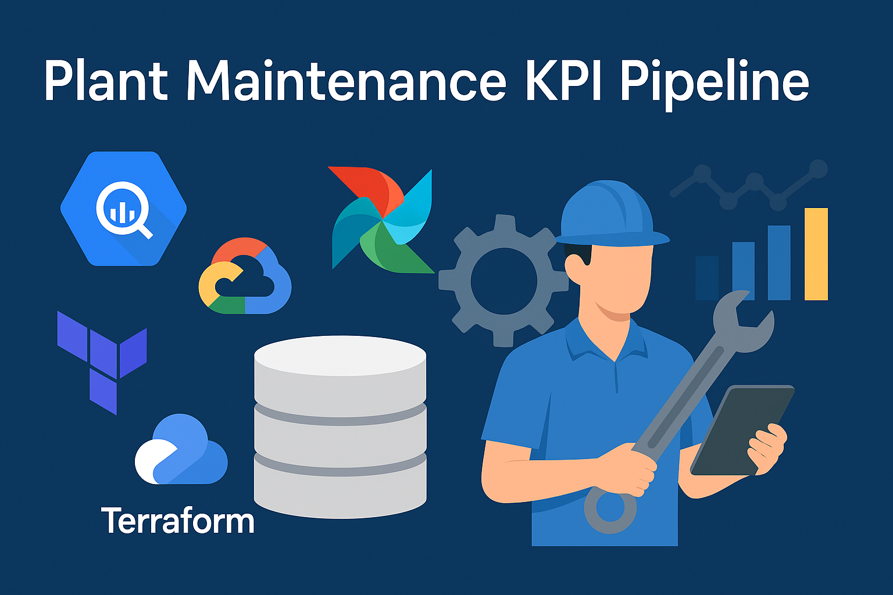

<p align="center">
  
</p>

# 🛠️ Plant Maintenance KPI Pipeline

Este proyecto implementa un pipeline completo de ingeniería de datos para analizar KPIs del área de mantenimiento industrial utilizando herramientas modernas como BigQuery, Dataform, Terraform, Airflow y Power BI.

---

## 🛠 Tecnologías utilizadas

- Google Cloud Platform (BigQuery, Cloud Storage)
- Terraform
- Dataform
- Apache Airflow (local)
- Power BI / Looker Studio
- Cloud Functions

---

## 🔄 Flujo de datos

1. **Ingesta**: Archivos `.csv` simulados (`ordenes_mantenimiento`, `backlog`) son cargados al bucket GCS `bucket-maintenance-kpi` mediante una Cloud Function.
2. **Procesamiento**: BigQuery almacena los datos en tablas intermedias.
3. **Modelado**: Dataform crea modelos (`ordenes`, `backlog`, `kpis`) y una assertion para validar calidad.
4. **Orquestación**: Airflow ejecuta el flujo mediante un DAG llamado `mantenimiento_kpis_dag`.
5. **Visualización**: KPIs expuestos en Power BI o Looker Studio desde BigQuery.

---

## 📁 Estructura del Proyecto

```
plant-maintenance-kpi-pipeline/
├── README.md
├── LICENSE
├── data/
│   ├── ordenes_mantenimiento.csv
│   └── backlog.csv
├── terraform/
│   └── main.tf
├── dataform/
│   ├── dataform.json
│   └── definitions/
│       ├── models/
│       │   ├── ordenes.sqlx
│       │   ├── backlog.sqlx
│       │   └── kpis.sqlx
│       └── assertions/
│           └── validar_ordenes.assertion.sqlx
├── dags/
│   └── mantenimiento_dag.py
├── cloudfunctions/
│   └── upload_ordenes_to_gcs/
│       ├── main.py
│       └── requirements.txt
├── docs/
│   ├── flujo_datos.md
│   └── configurar_ssh_github.md
└── dashboard/
    └── mantenimiento_kpi.pbix (opcional)
```

---

## 📊 KPIs generados

- % de órdenes preventivas vs correctivas
- Tiempo promedio por tipo de orden
- Backlog acumulado
- Órdenes por equipo técnico
- Equipos más intervenidos

---

## 🧪 Validaciones

Assertion definida en Dataform:

- `tiempo_hrs > 0`
- `fecha_creacion IS NOT NULL`
- `fecha_finalizacion IS NOT NULL`

---

## 🚀 ¿Cómo ejecutar?

### 1. Terraform

```bash
cd terraform
terraform init
terraform apply
```

### 2. Cloud Function (local)

```bash
cd cloudfunctions/upload_ordenes_to_gcs
pip install -r requirements.txt
python main.py
```

### 3. Dataform

```bash
cd dataform
npm install -g @dataform/cli
dataform install
dataform run
```

### 4. Airflow

Activa el DAG `mantenimiento_kpis_dag` desde la interfaz de Airflow.

---

## 📊 Dashboard

El archivo `dashboard/mantenimiento_kpi.pbix` puede abrirse con Power BI Desktop. También puede publicarse en Power BI Service o Looker Studio para visualización online.

---

**Autor:** Jonathan Tejo  
**Licencia:** MIT
